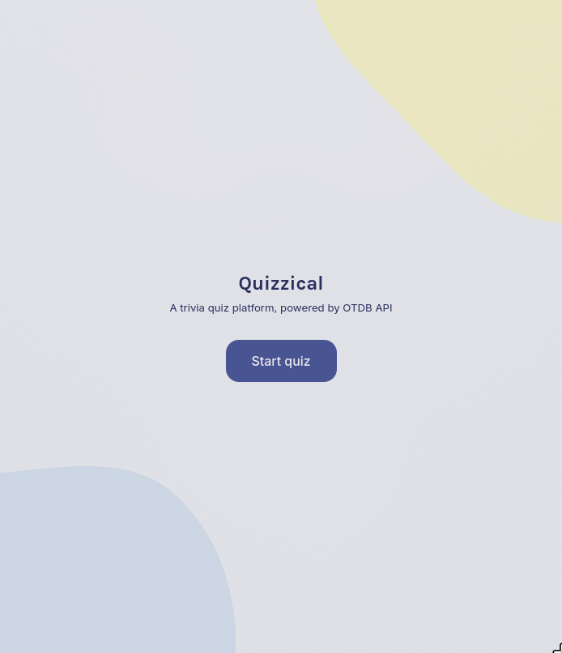
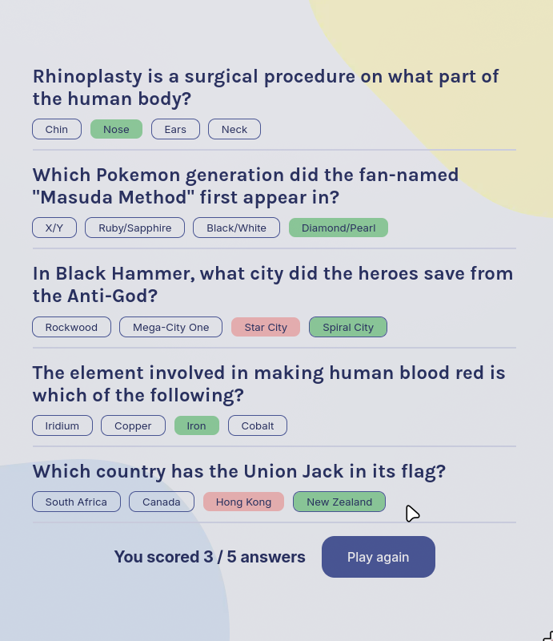

# [Quizzical](https://quizzical-lilac.vercel.app/)

A trivia game with questions pulled from OTDB API.

## Learnings:

1. Managing state properly for radio elements
2. Iterating over form data using for...of loops on formData.values(), formData.keys(), formData.entries()
3. Markdown supports HTML?!?!
